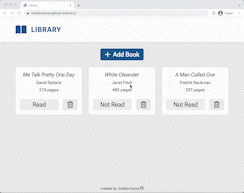

# Library

This simple library allows users to add and remove books as well as modify their read status. Built with HTML, CSS (Grid + Flexbox) and JavaScript.

[Live Demo](https://kristenmazza.github.io/library/) :point_left: